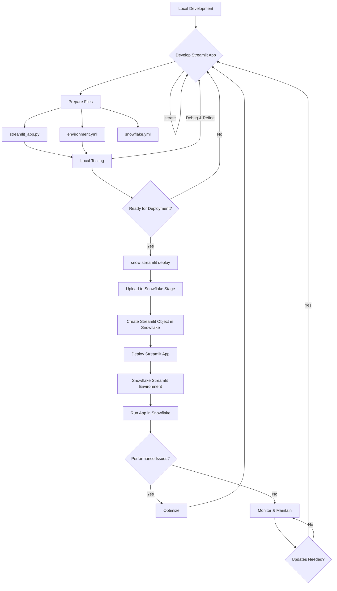

## Development workflow 

```mermaid
flowchart TD
    A[Local Development] --> B{Develop Streamlit App}
    B --> |Iterate| B
    B --> C[Prepare Files]
    C --> D[streamlit_app.py]
    C --> E[environment.yml]
    C --> F[snowflake.yml]
    D --> G[Local Testing]
    E --> G
    G --> |Debug & Refine| B
    G --> H{Ready for Deployment?}
    H --> |No| B
    H --> |Yes| I[snow streamlit deploy]
    I --> J[Upload to Snowflake Stage]
    J --> K[Create Streamlit Object in Snowflake]
    K --> L[Deploy Streamlit App]
    L --> M[Snowflake Streamlit Environment]
    M --> N[Run App in Snowflake]
    N --> O{Performance Issues?}
    O --> |Yes| P[Optimize]
    P --> B
    O --> |No| Q[Monitor & Maintain]
    Q --> R{Updates Needed?}
    R --> |Yes| B
    R --> |No| Q
```

## Dependencies

1. Create Connection 
2. Define warehouse 

## 